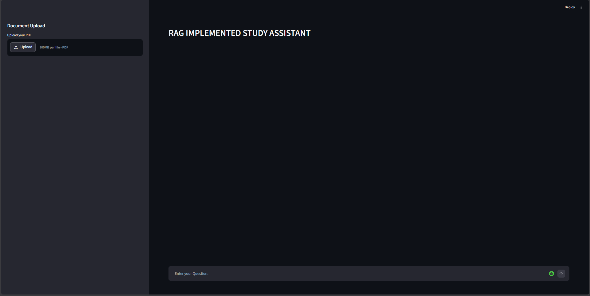
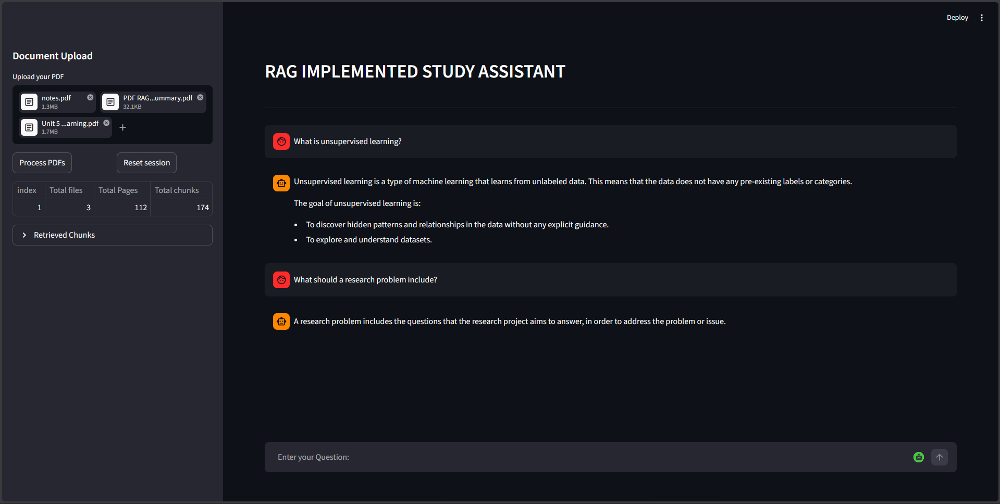

# Multi-Format RAG Chatbot with FAISS HNSW and Gemini

A Retrieval-Augmented Generation (RAG) chatbot that allows users to upload and query multiple PDF documents simultaneously. The system uses Sentence Transformers for embeddings, FAISS for vector retrieval, and Gemini 2.5 Flash for answer generation.

The chatbot performs semantic search across all uploaded documents, retrieves the most relevant chunks, and generates context-aware answers with document and page references. This is the latest branch for now; older versions are

v1.0.0: main
- Single PDF support
- Manual cosine similarity retrieval

v2.0.0: Faiss-IndexFlatIP
- FAISS IndexFlatIP retrieval

v3.0.0: multi-pdf
- Multi-PDF support
- Unified vector database

v4.0.0: v4
- Multi-format document support
- Paragraph-aware recursive chunking
- HNSW retrieval
- Conversation memory
- Improved metadata handling

---

## Why Build Without LangChain?

This project intentionally avoids LangChain to gain hands-on understanding of:

- PDF Processing
- Chunking Strategies
- Embedding Generation
- Vector Storage
- Semantic Retrieval
- Prompt Construction
- LLM Integration

Every stage of the RAG pipeline is implemented manually.

## 📸 Application Preview

### Main Interface



### Retrieval Transparency



### Working Demo: Checkout releases

Shows:
- Application UI
- Working model

## 🔍 Retrieval Transparency

The system exposes retrieved chunks to the user.

For every answer the application displays:

- Document Name
- Similarity Score
- Source Page Number
- Retrieved Context

This allows users to verify where information originated before trusting the generated answer.

## 🚀 Features

- Multi-format document support (PDF, DOCX, TXT, MD)
- Multi-document upload
- Unified knowledge base
- Paragraph-aware recursive chunking
- Sentence Transformer embeddings
- FAISS HNSW approximate nearest neighbor retrieval
- Conversation-aware responses
- Source citations
- Similarity score visualization
- Retrieval transparency
- Metadata dashboard
- Reset knowledge base
- Streamlit chat interface
---

# 🏗️ System Architecture

## Document Ingestion Pipeline

```text
Document Upload
(PDF / DOCX / TXT / MD)
           ↓
Document Reader
           ↓
Text Cleaning
           ↓
Paragraph-Aware Recursive Chunking
           ↓
Embedding Generation
           ↓
FAISS HNSW Index
           ↓
Store Vector Database
      
```

Generated files are stored as:

```text
vector_db/

├── chunks.json
└── embeddings.npy
└── index.faiss

---

## Retrieval Pipeline

User Query
      ↓
Query Embedding
      ↓
HNSW Retrieval
      ↓
Top-K Chunks
      ↓
Conversation Memory
      ↓
Prompt Builder
      ↓
Gemini 2.5 Flash
      ↓
Answer + Sources

---

## Example Retrieval Output

Document: MachineLearning.pdf
Page: 12
Similarity: 91.3%

Document: DeepLearning.pdf
Page: 7
Similarity: 88.4%

Document: NLP.pdf
Page: 3
Similarity: 85.9%

---

## Results

- Supports simultaneous querying across multiple PDF documents.
- Retrieves the Top-K most relevant chunks using FAISS.
- Displays source document names, page numbers, and similarity scores.
- Provides transparent retrieval for easier debugging and evaluation.

---

# 📂 Project Structure

```text
RAG_Project/

RAG-Project/
│
├── app.py
├── ingestion.py
├── retrieve.py
├── generate_answer.py
├── prompt_builder.py
├── requirements.txt
│
├── vector_db/
│ ├── chunks.json
│ ├── embeddings.npy
│ └── index.faiss
│
├── temp/
│
└── README.md
```

---
## Why HNSW?

The project initially used brute-force cosine similarity retrieval and later upgraded to FAISS IndexFlatIP.

This version uses FAISS HNSW (Hierarchical Navigable Small World Graphs), an Approximate Nearest Neighbor (ANN) search algorithm that organizes embeddings into a multi-layer graph structure.

Benefits:

- Faster retrieval at scale
- Better scalability for larger knowledge bases
- Efficient graph-based nearest neighbor search
- Industry-standard vector retrieval approach

# 🧠 Retrieval Workflow

### Step 1: Document Embedding

Each PDF is:

1. Extracted
2. Cleaned
3. Split into overlapping chunks
4. Converted into embeddings
5. Stored locally

Example:

```text
Chunk 1 → [384 values]
Chunk 2 → [384 values]
Chunk 3 → [384 values]
...
```

---

### Step 2: Query Embedding

User Question:

```text
What should a research problem include
```

↓

```text
[384-dimensional query embedding]
```

---

### Step 3: Semantic Retrieval

The query embedding is compared with all document chunk embeddings using FAISS index

```text
Query
   │
   ▼
Cosine Similarity
   │
   ▼
Top-K Relevant Chunks
```

---

### Step 4: Answer Generation

Retrieved chunks are inserted into a prompt and passed to Gemini.

```text
Retrieved Context
       +
User Question
       │
       ▼
Gemini
       │
       ▼
Answer
```

---

# 🛠️ Technologies Used
| Category              | Technology            |
| --------------------- | --------------------- |
| Language              | Python                |
| UI                    | Streamlit             |
| Document Processing   | PyMuPDF               |
| Word Processing       | python-docx           |
| Embeddings            | Sentence Transformers |
| Vector Search         | FAISS HNSW            |
| LLM                   | Gemini 2.5 Flash      |
| Storage               | JSON + NumPy          |
| Environment Variables | python-dotenv         |

| Parameter           | Value                              |
| ------------------- | ---------------------------------- |
| Embedding Model     | all-MiniLM-L6-v2                   |
| Embedding Dimension | 384                                |
| Chunking Strategy   | Paragraph-Aware Recursive Chunking |
| Retrieval Engine    | FAISS                              |
| Index Type          | HNSW                               |
| M                   | 32                                 |
| efConstruction      | 200                                |
| efSearch            | 100                                |
| Similarity Metric   | Cosine Similarity (L2 Normalized)  |
| LLM                 | Gemini 2.5 Flash                   |

# ⚙️ Installation

Clone the repository:

```bash
git clone <repository-url>
cd <repository-name>
```

Install dependencies:

```bash
pip install -r requirements.txt
```

Create a `.env`file:

```env
GEMINI_API_KEY=YOUR_API_KEY
```

---

## ▶️ Usage

Run the application:

```bash
streamlit run new_app.py

Steps
1. Upload one or more documents.
2. Click Process Files.
3. Wait for vector database generation.
4. Ask questions about uploaded documents.
5. Inspect retrieved chunks and sources.
6. Continue asking follow-up questions using conversation memory.


The system automatically:

* Extracts text
* Creates chunks
* Generates embeddings
* Stores the vector database

---

## Ask Questions

Example:

```text
Question:
What is a research problem?
```

```text
Answer:
A research problem is the first and most important step in the research process...
```

---

# 🎯 Sample Use Cases

* Academic PDF Question Answering
* Research Paper Exploration
* Study Material Assistant
* Internal Knowledge Base Search
* Semantic Document Search

---

## Future Improvements

- Persistent knowledge-base sessions
- Query expansion
- Metadata filtering
- Reranking
- Streamlit Cloud deployment
- LangChain implementation
- Parent-document retrieval
- Advanced evaluation metrics

---

## Key Improvements in V4

### Multi-Format Support
Supports PDF, DOCX, TXT, and Markdown documents.

### Recursive Chunking
Introduced paragraph-aware recursive chunking to preserve document structure and improve retrieval quality.

### HNSW Retrieval
Replaced IndexFlatIP with FAISS HNSW for scalable approximate nearest neighbor search.

### Conversation Memory
Recent chat history is injected into prompts, enabling context-aware follow-up questions.

### Improved Metadata Handling
Supports mixed document formats while preserving source attribution and retrieval transparency.

# 📚 Learning Outcomes

This project was built to understand the complete RAG pipeline without relying on abstraction frameworks.

Key concepts learned:

* Embeddings
* Vector Search
* Retrieval-Augmented Generation (RAG)
* Prompt Engineering
* Semantic Search
* LLM Integration
* End-to-End AI Application Development

---

## ⭐ Key Highlight

This project implements the core RAG workflow manually without LangChain, providing complete visibility into how document ingestion, embeddings, retrieval, prompt construction, and answer generation work under the hood.
